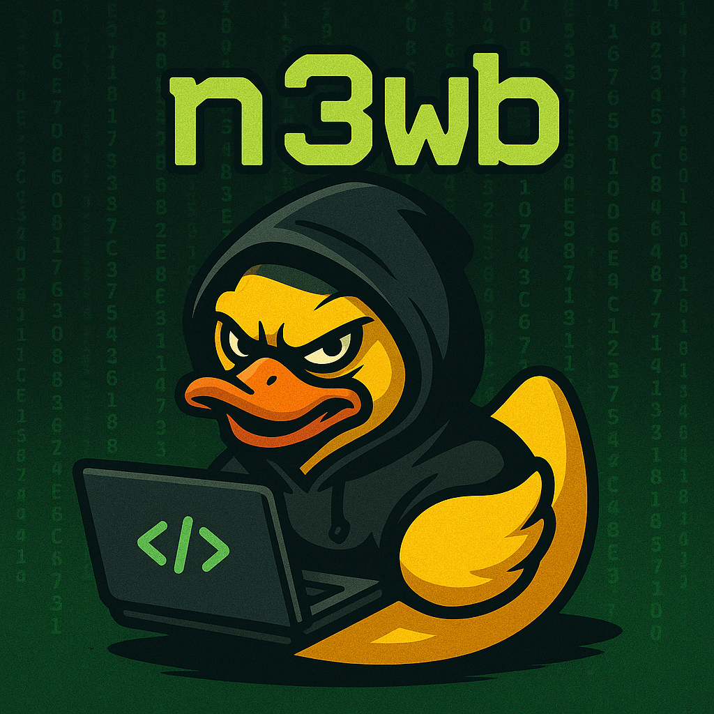
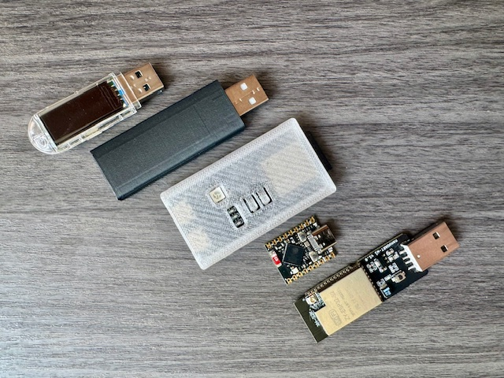
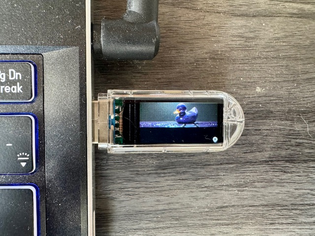

# N3WB WiFi Ducky

<p align="center">
    
</p>
<p align="center">
    
</p>

An advanced HID injection platform for the ESP32-S3 featuring:

* Full support for Hak5 DuckyScript v1/v2/v3 (including IF/ELSE/WHILE/DEFINE/VAR/REPEAT)
* Web interface for payload management
* BLE + USB HID keyboard/mouse
* USB Mass Storage mode
* GPIO-triggered payload execution
* LED/TFT feedback

---

## 🧨 Example Builds

<p align="center">
     
</p>

---

## 🧨 Attack Modes

Use `ATTACKMODE` in payloads to change the USB behavior:

```ducky
ATTACKMODE HID        # USB keyboard/mouse
ATTACKMODE STORAGE    # USB Mass Storage
ATTACKMODE HID STORAGE # Combined mode
```

Use `BUTTON_DEF <filename>` to define the script executed when the physical button is pressed.

Example: `payloads/Examples/attackmode_demo.txt`

---

## 🛠 Flashing using a web based flasher

To flash your ESP32 device:

1. Go to [https://esptool.spacehuhn.com/](https://esptool.spacehuhn.com/)
2. Connect your device over USB and select the correct port
3. Download the appropriate `.zip` firmware package from [Releases](https://github.com/x0SiN0x/n3wbWiFiDucky/releases)
4. Extract the `.zip` to get the `.bin` files:

   * `bootloader.bin` → `0x1000`
   * `partitions.bin` → `0x8000`
   * `firmware.bin`   → `0x10000`
   * `littlefs.bin`   → `0x290000` (for the lilygo device only right now)
5. Use the Web Flasher to upload those files at their respective offsets

No special drivers or tools are needed — works in Chrome/Edge via Web Serial.


---

## 🌐 Web Interface & WiFi

If no known Wi-Fi is available, the device creates a fallback AP:

* **SSID**: `iPh0ne12`
* **Password**: `12345678`

Access the interface at:

* `http://192.168.4.1`
* Or `http://n3wbswifiduck.local` (via mDNS)

From here, you can:

* Upload/edit/run DuckyScript payloads
* Set Wi-Fi, locale, autorun, button behavior

---

## 📝 Supported DuckyScript Features

| Feature                               | Supported     |
| ------------------------------------- | ------------- |
| `STRING`, `ENTER`, `TAB`, `ESC`, etc. | ✅             |
| `DELAY`, `DEFAULT_DELAY`, `REPEAT`    | ✅             |
| `REM` (comments)                      | ✅             |
| `IF`, `ELSE`, `ENDIF`                 | ✅             |
| `DEFINE`, `VAR`                       | ✅             |
| `WHILE`, `ENDWHILE`, `BREAK`          | ✅             |
| `ATTACKMODE`, `BUTTON_DEF`            | ✅             |
| `MOUSEMOVE`, `CLICK`, `SCROLL`        | ✅             |
| `MEDIA_*`, `VOLUMEUP`, `MUTE`, etc.   | ✅             |
| Locale switching (`LOCALE US`, etc.)  | ✅             |
| Script chaining (`INCLUDE`)           | ❌ (not yet)   |
| `CONTINUE`                            | ❌ (not found) |

---

## 🧪 Additional Features

* ✅ BLE HID injection via `BleComboKeyboard`
* ✅ USB Mass Storage mode (FFat + USB MSC)
* ✅ LED status feedback
* ✅ GPIO trigger configuration
* ✅ TFT screen support (optional)

---

## 🧠 Credits

Based on work from:

* [spacehuhn/WiFiDuck](https://github.com/spacehuhn/WiFiDuck)
* [Hak5 DuckyScript](https://docs.hak5.org/hak5-usb-rubber-ducky)

Fork maintained and extended by **x0SiN0x**.

---
